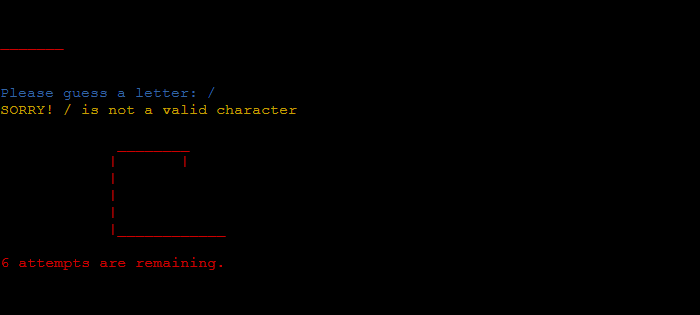

# **Hangman**

Hangman is an old school favorite, a word game where the goal is simply to find the missing word or words.

You will be presented with a number of blank spaces representing the missing letters you need to find.

Use the keyboard to guess a letter (I recommend starting with vowels).

If your chosen letter exists in the answer, then all places in the answer where that letter appear will be revealed.

After you've revealed several letters, you may be able to guess what the answer is and fill in the remaining letters.

Be warned, every time you guess a letter wrong you loose a life and the hangman begins to appear, piece by piece.

Solve the puzzle before the hangman dies.

**GitHub repository** can be found by clicking <a href="https://github.com/kazcare/hangman" target="_blank" rel="noopener">**here**.</a> and the deployed **live link** for the website can be found by clicking <a href="https://han-man.herokuapp.com/" target="_blank" rel="noopener">**here**.</a>    

## Table of contents 
* [Hangman](#hangman)
    * [Flow Chart](#flow-chart)
    * [User Experience](#user-experience)
        * [Project Goals](#project-goals)
        * [User Stories](#user-stories)
        * [Colored Text](#colored-text)
        * [Main Features](#main-features)
            * [Technology Used](#technology-used)
            * [Coding Environment](#coding-environment)
            * [Languages](#languages)
    * [Testing](#testing)
        * [Validation Testing](#validation-testing)
        * [Bugs](#bugs)
            * [Bugs Fixed](#bug-fixed)
    * [Deployment](#deployment)
    * [Credits](#credits)

## Flow Chart

Planning of this project was based on the flow charts using the platform Lucid Charts.

[Back to Top](#table-of-contents)

## User experience
### Project Goals

- It should give user an option to retry after every game
- It should clearly shows user his/ her progress throwout the game
- It should validate the user entry, it should only be a single alphabetic character.

[Back to Top](#table-of-contents)

### User Stories

- As a player, I want the game to be user friendly.
- As a player, I want the game to be fun and engaging.
- As a player, I want the game to show me progress in the game by showing hangman images
- As a player, after every game, I want app to give me option to either replay or end the game.
- As a player, I want the game to give me warning if I accidently enter an invalid character and should not count it as an attempt/ try.

[Back to Top](#table-of-contents)

### Coloured Text

I used a simple colour scheme to improve the overall user experience and make it easy to understand color-coded messages.
- The colour red ("\033[0;31m) was used for wrong guesses.
- The colour yellow ("\033[0;33m) was used for invalid entries.
- The colour green ("\033[0;32m) was used for correct guesses.
- The colour blue ("\033[0;34m) was used for input lines.

[Back to Top](#table-of-contents)

### Main Feature

- **Title/ Welcome message**
    - It contains title with welcome message

- **Start of the game**
    - Game starts when the app loads
    - Asks user to input any letter to guess the word
    - It is colour coded in blue

- **Invalid Guess**
    - It warns user if a non-alphabetic character is keyed in
    - It is colour coded in yellow

- **Wrong Guess**
    - It let's user know that the guessed letter is not in the word
    - Hangman image shows the next stage and number of attempts remaining underneath it
    - It is displayed in red colour

- **Correct guess**
    - Informs user that the guessed letter is in the word
    - It shows the letter on it's position in the word
    - this message shows in green colour

- **Win**
    - When the whole word is guessed by the user, it congratulates the user on guessing the word
    - It is green colour coded

- **Lose**
    - If user is not succeful guessing the word after 6 wrong attemts, the game is over
    - it tells user that it was not a successful attemp
    - User get a message with the correct word and 
    - User get message in red colour

- **Play again**
    - At the end of every game it asks user to play again.
    - If user press y new game starts with a different word
    - If user press n game ends
    - It displays in blue

[Back to Top](#table-of-contents)

#### **Technology Used**

- GitPod was used for writing code, committing, and then pushing to GitHub.
- Github was used to store the project after pushing.
- Lucid Charts was used to create and design the flow chart used in the logical design of this project.
- PEP8 online check was used to validate the python code.
- Heroku was used to deploy the application.

[Back to Top](#table-of-contents)

#### **Coding Environment**

I used Gitpod IDE to code my project. 

* Following procedures are to be followed to get to the Gitpod IDE.

    1. Firstly you need to login to your GitHub account.

    2. Create a new repository by clicking green "New" button on the right hand side.

    3. Once the repository is created, click the repository to open it.

    4. Once it is opened, click the green "Gitpod" button on the right hand side to create a Gitpod workspace. It takes some time to create it.
        
* Note: Once the Gitpod workspace is created for certain repository, do not click the green Gitpod button again, as it will create another workspace for the same repository. Everytime after the Gitpod workspace is created, access it by clicking <a href="https://gitpod.io/workspaces" target="_blank" rel="noopener">gitpod.io/workspaces</a>.

    5. In the Gitpod IDE there are three main sections: 
        - On the left hand side there is an explorer that shows the list of the files and folders in the project. 
        - The right hand side is divided into two portions vertically. 
        - Bigger portion on the top is for write codes and the bottom is to write commands for the Gitpod IDE.

    6. Every change made to the any file and folder in the project has to be sent to GitHub, otherwise the deployed project will not show those changes.

    7. To send the changes to GitHub following three steps to be followed:
        - First, changes are to be added by giving command 'git add filename' or use 'git add .' for adding all the changes to more than one item in the project. 
        - Once these changes are added, a commit command to be entered by giving command 'git commit -m "message regarding changes made since last commit" '. 
        - After the commit command 'git push' command is to be entered to push all the chages to the deployed project.

#### **Languages**

- Python

[Back to Top](#table-of-contents)

## Testing

#### **Data Validation**
    - Guessed letter is chacked to verify if it is alphabetic character
    - None other characters are allowed to be used.

#### **Entry Validation**
    - informs user if same letter is being guessed more than once

#### **Empty Field Validation**
    - It informs user if the nothing is entered by error
    - It does not cost user any attemts

#### **Progress Validation**
    - Every incorrect guess decreases the number of attempts remaining
    - It is shown with the complementing image

#### **Replay Validation**
    - It gives user an option to start the game again with newly selected word

[Back to Top](#table-of-contents)

### **Validation Testing**

#### **Initial Validation Testing**

#### **Final Validation Testing**

[Back to Top](#table-of-contents)

### Bugs
#### Bugs Fixed

Game was only showing the image to let user know the progress.
Added a message with number of attempts remaining.

[Back to Top](#table-of-contents)

## Deployment

he application has been deployed using Heroku by following these steps:

Heroku was used to deploy the application.

- Before we deploy application, you must commit changes and push them to GitHub.
- Go to the <a href="https://www.heroku.com" target="_blank" rel="noopener">Heroku's website</a>.
- Create an account or select log in if you have an account already.
- From the Heroku dashboard, click on "Create new app".
- Enter the "App name" and "Choose a region" before clicking on "Create app".
- Go to "Config Vars" under the "Settings" tab.
- Click on "Reveals Config Vars" and add the KEY: CREDS and the VALUE stored in creds.json file if needed.
- Add the Config Var, KEY: PORT and VALUE: 8000.
- Go to "Buildpacks" section and click "Add buildpack".
- Select "python" and click "Save changes"
- Add "nodejs" buildpack as well using the same process.
- Go to "Deployment method", under the "Deploy" tab select "GitHub" and click on "Connect to GitHub".
- Go to "Connect to GitHub" section and "Search" the repository to be deployed.
- Click "Connect" next the repository name.
- Choose "Automatic deploys" or "Manual deploys" to deploy your application.

    
[Back to Top](#table-of-contents)

## Credits

- I would like to inform you all that this project (Hangman) is built for educational purpose only. I have rendered the following items and information from different resources. I would like to thank all of these resources for helping me completing my project.
- <a href="https://www.w3schools.com//" target="_blank" rel="noopener">W3Schools</a> was used as a resource for solving syntax errors.
- I referenced <a href="https://ozzmaker.com/add-colour-to-text-in-python/" target="_blank" rel="noopener">ozzmaker.com</a> and <a href="https://stackabuse.com/how-to-print-colored-text-in-python/" target="_blank" rel="noopener">stackabuse.com</a> for using coloured text.
- Copied some text from the <a href="https://thewordsearch.com/" target="_blank" rel="noopener">thewordsearch.com</a> to use in the README.md.

[Back to Top](#table-of-contents)
